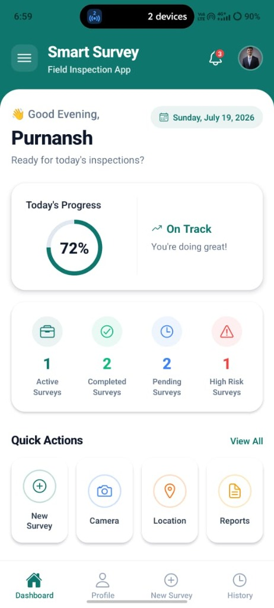
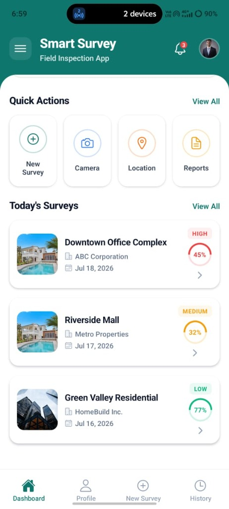
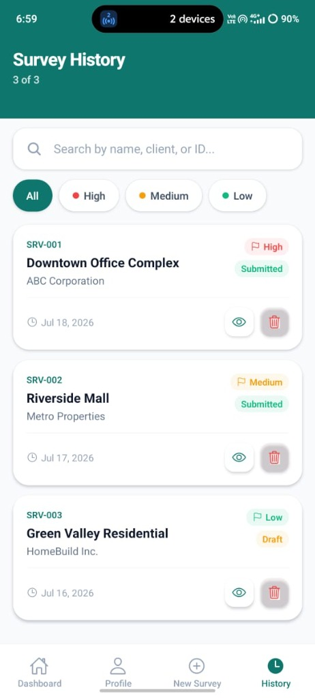

# SmartSurvey — Smart Field Survey & Inspection App 📱🏗️

**SmartSurvey** is a modern, premium, cross-platform mobile and web application built using **React Native** and the **Expo** framework. It is specifically designed to streamline and digitize the field survey and site inspection process, replacing traditional paper forms with a fast, reliable, and offline-first digital solution.

The project features a sleek design, dynamic statistics, native camera/gallery integration, and automated GPS location fetching with offline persistence.

---

## 📸 Screenshots

<p align="center">
  
  
  
</p>

---

## ✨ Features

- 📱 **Cross-Platform Compatibility**: Run the application seamlessly on **iOS, Android, and Web** from a single codebase.
- 🎨 **Premium UI/UX**: Includes a custom design system with layered cards, rounded aesthetics, dynamic progress rings, and custom icons.
- 💾 **Offline-First Storage**: Implements local persistence via `@react-native-async-storage/async-storage`. Edits and creations survive reloads and network loss.
- 📸 **Native Device Media**: Integrate with `expo-image-picker` to capture site inspection photos using the camera or import them from the gallery.
- 📍 **GPS Geo-tagging**: Automates coordinate capture (Latitude, Longitude, and Accuracy) using `expo-location` with a testing fallback.
- 🔍 **Survey Management & History**: Filter and search through active surveys by ID, site name, client, or priority level (High, Medium, Low).
- 🗑️ **Quick Deletions**: Allows deleting draft surveys via long-press on the Dashboard or through the details Preview screen.
- 🍔 **Hamburger Menu Navigation**: Accessible navigation drawer that provides shortcut links to every module in the application.

---

## 🛠️ Tech Stack & Libraries

- **Framework**: [React Native](https://reactnative.dev/) with [Expo (SDK 54)](https://expo.dev/)
- **Navigation**: File-based routing via [Expo Router](https://docs.expo.dev/router/introduction/)
- **State Management**: React Context API (`ProfileContext`, `SurveyContext`)
- **Data Persistence**: React Native Async Storage
- **Device APIs**:
  - `expo-image-picker` (Camera & Photo Library Access)
  - `expo-location` (GPS Coordinate Fetching)
  - `expo-haptics` (Haptic Feedback)

---

## 🚀 Getting Started

### Prerequisites
Make sure you have Node.js and the Expo CLI installed on your machine.

### Installation

1. Clone the repository:
   ```bash
   git clone https://github.com/Purnansh29/smart-field-survey-inspection-app.git
   cd smart-field-survey-inspection-app/survey
   ```

2. Install the required dependencies:
   ```bash
   npm install
   ```

3. Start the local development server:
   ```bash
   npx expo start
   ```

---

## 📂 Project Structure

```
survey/
├── app/                  # Expo Router directory (Screens and Navigation)
│   ├── (tabs)/           # Main bottom tabs (Dashboard, Profile, New Survey, History)
│   ├── menu.tsx          # Drawer Hamburger Menu
│   ├── survey-preview.tsx# Survey Details screen
│   └── edit-profile.tsx  # Edit Profile screen
├── components/           # Reusable UI components (Form inputs, Headers, Cards)
├── constants/            # Styling theme values (colors, shadows, spacing)
├── contexts/             # Global Context API providers (Profile, Survey lists)
└── types/                # TypeScript type definitions
```

---

## 👤 Developer

* **Purnansh Patel** — *React Native Developer*
* GitHub: [@Purnansh29](https://github.com/Purnansh29)